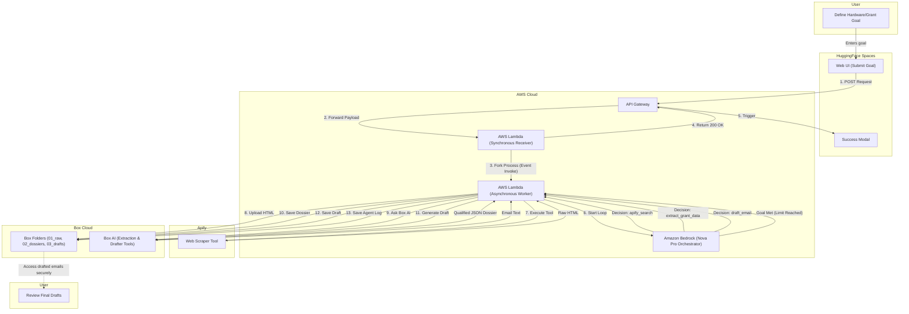

# System Architecture: AWS Agent Loop

```mermaid
flowchart TD
    subgraph USER_START [User]
        Start["Define Hardware/Grant Goal"]
    end

    subgraph FRONTEND [HuggingFace Spaces]
        UI["Web UI (Submit Goal)"]
        Popup["Success Modal"]
    end

    subgraph AWS [AWS Cloud]
        Gateway["API Gateway"]
        LambdaSync["AWS Lambda (Synchronous Receiver)"]
        LambdaAsync["AWS Lambda (Asynchronous Worker)"]
        Bedrock["Amazon Bedrock (Nova Pro Orchestrator)"]
    end

    subgraph APIFY [Apify]
        Scraper["Web Scraper Tool"]
    end

    subgraph BOX [Box Cloud]
        Storage["Box Folders (01_raw, 02_dossiers, 03_drafts)"]
        BoxAI["Box AI (Extraction & Drafter Tools)"]
    end

    subgraph USER_END [User]
        Review["Review Final Drafts"]
    end

    %% Sync Flow
    Start -->|"Enters goal"| UI
    UI -->|"1. POST Request"| Gateway
    Gateway -->|"2. Forward Payload"| LambdaSync
    LambdaSync -->|"3. Fork Process (Event Invoke)"| LambdaAsync
    LambdaSync -->|"4. Return 200 OK"| Gateway
    Gateway -->|"5. Trigger"| Popup

    %% Async Agent Loop
    LambdaAsync -->|"6. Start Loop"| Bedrock
    
    %% Web Search
    Bedrock -->|"Decision: apify_search"| LambdaAsync
    LambdaAsync -->|"7. Execute Tool"| Scraper
    Scraper -->|"Raw HTML"| LambdaAsync
    
    %% Extraction
    Bedrock -->|"Decision: extract_grant_data"| LambdaAsync
    LambdaAsync -->|"8. Upload HTML"| Storage
    LambdaAsync -->|"9. Ask Box AI"| BoxAI
    BoxAI -->|"Qualified JSON Dossier"| LambdaAsync
    LambdaAsync -->|"10. Save Dossier"| Storage
    
    %% Drafting
    Bedrock -->|"Decision: draft_email"| LambdaAsync
    LambdaAsync -->|"11. Generate Draft"| BoxAI
    BoxAI -->|"Email Text"| LambdaAsync
    LambdaAsync -->|"12. Save Draft"| Storage
    
    %% Final
    Bedrock -->|"Goal Met (Limit Reached)"| LambdaAsync
    LambdaAsync -->|"13. Save Agent Log"| Storage

    Storage -.->|"Access drafted emails securely"| Review
```
